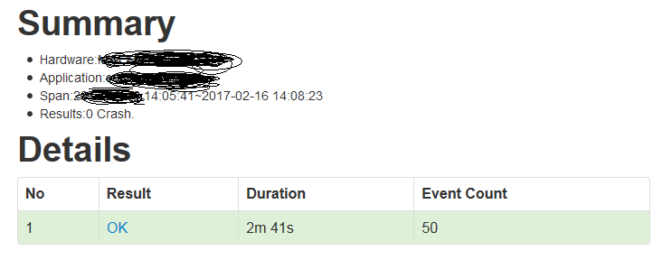
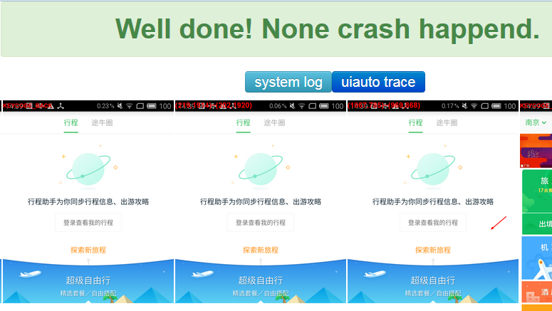

# 简介
这个项目是CrashMonkey4Android可执行文件

该项目从 https://github.com/DoctorQ/CrashMonkey4Androd_bin 复制而来

原版不支持64位java，只支持32位的

此版本支持java 64位，并且修改了一些内部逻辑，把CrashMonkey4Android 和CrashMonkey4Android_tradefederation 重新打包


# CrashMonkey4Android 简介

CrashMonkey4Android,是一个依靠Cts框架,对原生Monkey进行改造后的产物,拥有以下新增功能:

 1. 保存每一步的截图.
 2. 保存logcat.
 3. 保存每一个Monkey事件的信息.
 4. 分析Crash.
 5. Html报告.
 6. 支持多设备.
 
# 执行和报告
前提保证手机已经连接到电脑，adb devices命令能找到设备；默认配置文件在android-cts\tools\config\cts.xml，可自行修改

启动脚本在tools文件夹下，windows执行start.bat，mac执行 start;

在打开的窗口命令行中输入  ```run cts --p 测试app的包名 --a 测试app的主activity```,然后回车；

android-cts\repository\logs  存放执行日志和截图

android-cts\repository\results 存在执行的报告，index.html 是报告的入口

多个设备可同时进行，报告是分开的，默认执行50次会生成一个报告，之后会循环执行

# 报告截图
## index



## result



## trace


# 环境要求
 

 1. 安装JDK1.7+并配置环境变量.
 2. 安装SDK并配置环境变量.

 


# 参数配置

我们提供了很多可供配置的参数.

## 查看参数

> 我们可以通过在命令行下输入```run cts --help-all``` 获取所有的可设置参数:

```
test options:
    --p                  package of test app
    --a                  main activity of test app
    --v                  monkey event count Default: 20.
    --throttle           The delay time between the events Default: 300.
    --pct-touch            percentage of tap event Default: 75.0.
    --pct-motion         percentage of motion event Default: 25.0.
    --pct-syskeys        percentage of system key event Default: 5.0.
    --logcat-size        The max number of logcat data in bytes to capture when --logcat-on-failure is on. Should be an amount that can comfortably fit in memory. Default: 20480.
    --plan               the test plan to run.
    --[no-]reboot        Do not reboot device after running some amount of tests. Default behavior is to reboot. Default: false.
    --[no-]skip-device-info
                         flag to control whether to collect info from device. Providing this flag will speed up test execution for short test runs but will result in required data being omitted from the test report. Default: false.
    --[no-]device-unlock unlock device Default: false.
    --app-path           local app's path
    --wifiSsdk           wifi username
    --wifiPsk            wifi password
    --[no-]skip-uninstall-app
                         no uninstall test app Default: true.
    --monkey-log-size    monkey log size Default: 10485760.
    -b, --[no-]bugreport take a bugreport after each failed test. Warning: can potentially use a lot of disk space. Default: false.
    --[no-]tracefile     get trace file ,in /data/anr/trace.txt Default: false.

  'stdout' logger options:
    --log-level          minimum log level to display. Default: INFO. Valid values: [VERBOSE, DEBUG, INFO, WARN, ERROR, ASSERT]

  
```
## 主要属性:


 1. p :测试app的包名.
 2. a :测试app的主activity,如果正确设置上面两项,Monkey会针对上面-p指定的应用测试,一直保持在该应用界面.
  注意:-a和-p两个参数要一起使用,否则不起作用.
 3. throttle:2个Monkey事件之间的间隔,默认为300毫秒.
 4. pct-touch:点击事件的百分比,默认为70%.
 5. pct-motion:多点滑动事件百分比,默认为25%.
 8. pct-syskeys:系统事件百分比.（只保留了 Back操作）,默认为5%.

>可以定制比例，但是上面的数字相加一定要为100%.


10. reboot : 重启机器,默认为false,不重启.如果想要重启的话,直接在命令行附上该参数,不用在后面加true,因为boolen类型的设置方式和其他不一样.
11. device-unlock:解锁手机,默认为false,如果收集重启的话,建议将该属性设置为true.解锁原理就是利用appium自带的apk来解锁的.
12. skip-device-info:是否跳过设备信息获取,默认为false.因为我们的报告中用到了设备信息,所以建议不要将该属性设置为true.
13. app-path:如果应用需要从本地安装,用该属性设置app路径,会自动安装app到收集端.
14. wifiSsdk:wifi的用户名
15. wifiPsk:wifi的密码

> 因为该工具支持自动连接wifi,所以你的app需要在wifi情况下工作,请设置这两个属性,它会自动检测断网并重连.

16. skip-uninstall-app:是否跳过卸载app的阶段,因为如果使用本地app安装后,有时想卸载应用,可以设置该属性为false.默认是不卸载.
17. monkey-log-size:如果针对某一个应用测试,该工具为该app单独收集log,这里可以设置log可以最大到多少B.
18. bugreport:是否保存bugreport信息,默认为false.如果研发想要bugreport信息,将该属性设置为true.
19. tracefile:是否保存trace.txt文件,该文件位于/data/anr/trace.txt.一般发生crash的时候会用到该文件分析问题.
